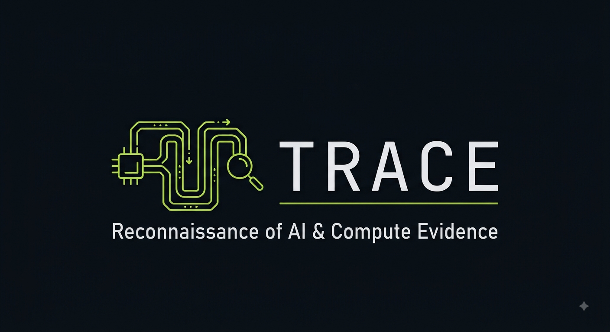

<div align="center">

<!-- ════════════════════════════════════════════════════════════════════ -->
<!--  TRACE — hero banner (brand: crimson / dark)  -->
<!-- ════════════════════════════════════════════════════════════════════ -->

<p align="center">
  
</p>

# TRACE

**Tool for Reconnaissance of AI & Compute Evidence**

> *Leave no model untraced.*

Forensically sound, cross-platform CLI + Velociraptor artifact pack for collecting and
analyzing forensic evidence from AI/ML harnesses — local inference engines, agent
frameworks, AI dev tools, live network AI traffic, and source-code AI scanning.

```
$ trace discover
  ✓ ollama            (inference)     14 artifacts
  ✓ hermes            (agent)         60 artifacts
  ✓ huggingface       (cloud)         68 artifacts
  ✓ text_gen_webui    (inference)      2 artifacts
  ✓ llama_cpp         (inference)      2 artifacts
  ✓ network_ai        (live)          process→domain classification
```

<!-- Hero buttons -->
[](https://github.com/ionsec/trace#quick-start)
[](https://github.com/ionsec/trace)
[](https://ionsec.io/trace)
[](LICENSE)

---

**Developed by [TRACE](https://github.com/ionsec/trace)**

> **USE AT YOUR OWN RISK.** TRACE is provided **as is, without warranty of any kind**,
> express or implied, including but not limited to the warranties of merchantability,
> fitness for a particular purpose, and noninfringement. In no event shall the
> contributors be liable for any claim, damages, or other liability arising from the use
> of this tool. Always test on non-production systems and obtain authorization before
> running on any machine you do not own.

</div>

---

## Features

- **27 Collectors** — DeepSeek Harness (dsh), Ollama, Hermes, LM Studio, GPT4All, text-generation-webui, llama.cpp, KoboldCpp, AutoGPT, CrewAI, Aider, Shell-GPT, Cursor, Claude Code, HuggingFace, LiteLLM, Bifrost, Unsloth, Antigravity, Devin, VSCodium, Eigent + the Shadow AI meta-collector, the Network AI collector (live process→domain AI traffic), the Code Scanner collector (AI framework imports, MCP configs, hardcoded API keys), the Docker AI collector (Gordon + hosted LLM images/containers), and the Browser AI collector (Brave Leo, Perplexity, Copilot, ChatGPT, Gemini web)
- **Live Network AI Detection** — correlates running processes with outbound connections and classifies destination domains against a catalog of 100+ AI providers (OpenAI, Anthropic, Gemini, Bedrock, etc.)
- **Source-Code AI Scanning** — detects AI framework imports (LangChain, CrewAI, AutoGen, 80+ others), MCP server registrations, and hardcoded API keys in code
- **Docker AI Detection** — detects Docker's AI assistant (Gordon) and hosted LLM workloads (ollama, LocalAI, vLLM, OpenWebUI, etc.) in containers and the model registry
- **Browser AI Forensics** — captures browser-based AI assistant evidence (Brave Leo, Perplexity, Microsoft Copilot, ChatGPT, Claude, Gemini web) from browser history and per-site conversation stores
- **Full Analyzer Set** — Unified Timeline, IOC Extractor, MITRE ATLAS Mapper, Risk Scorer, AI-specific IOC Detector, Enhanced Risk Scorer, and Conversation Parser
- **3 Report Formats** — Interactive HTML (attack-surface map, charts, stats), JSON, STIX 2.1
- **15 Velociraptor Artifacts** — Deploy to fleet endpoints via Velociraptor server
- **Forensically Sound** — Read-only collection, SHA-256 per file, chain of custody manifest, UTC timestamps
- **Cross-Platform** — Linux, macOS, Windows paths per collector

## Quick Start

```bash
# Install
pip install ionsec-trace

# Discover AI platforms on the system
trace discover

# Collect all forensic artifacts
trace collect --output /tmp/evidence --deep

# Analyze collected evidence
trace analyze /tmp/evidence --mitre-atlas --mitre-attack --risk-score

# Generate reports (HTML, JSON, STIX 2.1)
trace report /tmp/evidence --format all
```

## Go Binary (no Python required)

TRACE ships as a **single self-contained Go binary** with **near-identical
capabilities to the Python CLI** — the same platform catalog, the same 103-rule
secret detector, the same IOC extraction, conversation forensics, MITRE
ATLAS/ATT&CK mapping, kill-chain reconstruction, risk scoring, and the same
HTML, JSON and STIX 2.1 reports. The one exception: the Go
binary collects SQLite conversation stores but does not parse them (see
[Python / Go capability parity](#python--go-capability-parity)). Prebuilt
executables for macOS, Linux, and
Windows live in `go/bin/` (build with `make -C go`), or build your own:

```bash
make -C go all    # builds bin/trace-{darwin,linux,windows}-{amd64,arm64}
```

The CLI is fully **branded and interactive**: a two-tone crimson logotype
banner, branded header boxes, severity-colored output, and live spinners during
long operations. Every scan/run prints the executing machine's system info and
a timestamp.

```bash
# ONE-SHOT SWEEP: discover → deep collect → HTML + JSON reports
./bin/trace-darwin-arm64 run -o /tmp/evidence

# Detect shadow-AI tools
./bin/trace-darwin-arm64 discover

# Quick risk summary with system info + timestamp (no files written)
./bin/trace-darwin-arm64 scan

# Collect forensic artifacts + chain of custody
./bin/trace-darwin-arm64 collect -o /tmp/evidence --deep

# Analyze: IOCs, secrets, conversations, MITRE, kill chain, risk
./bin/trace-darwin-arm64 analyze /tmp/evidence --mitre-atlas --mitre-attack --risk-score --secret-hunt

# Generate HTML, JSON and STIX 2.1 reports from existing evidence
./bin/trace-darwin-arm64 report -o /tmp/evidence --format all

# Push the case into DFIR-IRIS
./bin/trace-darwin-arm64 iris /tmp/evidence --host https://iris.example.com --api-key "$IRIS_API_KEY"
```

On Windows, pass a Windows path to `-o` (`C:\evidence`, `.\evidence`) instead of
the POSIX form above — `/evidence` has no drive letter and resolves against the
drive of the current directory. Every command prints the resolved absolute path:

```powershell
trace-windows-amd64.exe collect -o C:\evidence --deep
```

### Python / Go capability parity

Both builds share one forensic data model (chain of custody, SHA-256 hashing,
UTC timestamps) and one analysis contract, so evidence produced by either is
interchangeable and either can report on the other's output. Capabilities are
**near-identical**, with one deliberate exception: the Go binary carries no cgo
or system-library dependencies (see below) and therefore collects SQLite
conversation stores but does not parse them.

| Capability | Python CLI | Go binary |
|---|---|---|
| Platform catalog (27 platforms, 47 shadow-AI tools) | ✅ | ✅ |
| Curated collection + chain of custody | ✅ | ✅ |
| IOC extraction (IPs, URLs, domains, hashes, paths, commands, exfil patterns) | ✅ | ✅ |
| Secret detection (103 rules, entropy gating, allowlists) | ✅ | ✅ |
| Conversation forensics + jailbreak/injection detection | ✅ | ✅ |
| Conversation secret hunt (leak direction, per-field provenance) | ✅ | ✅ |
| SQLite conversation-store parsing (schema, row estimates, redacted samples) | ✅ | ❌ |
| Unified timeline | ✅ | ✅ |
| MITRE ATLAS + ATT&CK mapping | ✅ | ✅ |
| Kill chain, priority actions, narratives, correlations | ✅ | ✅ |
| Risk scoring + enhanced risk breakdown | ✅ | ✅ |
| HTML / JSON / STIX 2.1 reports | ✅ | ✅ |
| DFIR-IRIS case push | ✅ | ✅ |

The Go source is in `go/`. Its only dependency is a pure-Go Zstandard decoder
(DeepSeek Harness writes compressed transcripts), so it still cross-compiles
cleanly with no cgo and no system libraries. That
means it cannot open SQLite conversation stores: it collects them (and hashes
them into the chain of custody) but does not parse them into analyst-facing
summaries. Use the Python CLI when you need SQLite conversation parsing.

### Curated evidence collection

Collection is deliberately **curated to analyst-parseable artifacts** — only
config, history, session, credential, and conversation stores are retained.
Unparseable noise (compiled extensions, README/LICENSE, `.DS_Store`, model
blobs, node_modules, automated backups) is skipped, so the evidence set stays
readable and low-noise instead of ballooning into hundreds of binary blobs.

Non-readable structured stores are **parsed into analyst-facing summaries**:
SQLite conversation/state databases yield their schema (table list), row
estimates, and redacted sample strings; text config/log files get a bounded
readable preview. These summaries are embedded in the generated JSON report
under `parsed_artifacts[]`.

## CLI Commands

| Command | Description |
|---------|-------------|
| `trace discover` | Detect installed AI platforms |
| `trace collect -o DIR` | Collect forensic artifacts to directory |
| `trace analyze DIR` | Analyze collected evidence (timeline, IOCs, ATLAS/ATT&CK, risk) |
| `trace report DIR` | Generate HTML/JSON/STIX reports |
| `trace scan` | Quick triage scan |
| `trace iris push DIR` | Push evidence into a DFIR-IRIS case |
| `trace iris check` | Verify connectivity/API key against IRIS |

### Options

- `--deep` — Collect session-level data (conversations, chat history)
- `--platforms ollama,hermes` — Collect from specific platforms only
- `--mitre-atlas` — Map findings to MITRE ATLAS techniques
- `--mitre-attack` — Map findings to MITRE ATT&CK techniques
- `--risk-score` — Calculate risk scores (0-100)
- `--secret-hunt` — Scan conversation turns for leaked secrets (leak direction, per-field provenance, salted fingerprints)
- `--export-conversations` — Export conversation history to CSV + SHA-256 manifest
- `--format html|json|stix|all` — Report format

## Collection Output

```
/tmp/evidence/
├── CHAIN_OF_CUSTODY.json    # SHA-256 manifest with timestamps
├── TRACE_Report_<id>.html   # Interactive forensic report (map, charts, stats)
├── TRACE_Report_<id>.json   # Structured JSON report
└── TRACE_Report_<id>.stix.json  # STIX 2.1 bundle for MISP/OpenCTI
```

### Chain of Custody

Every collection produces a `CHAIN_OF_CUSTODY.json` containing:

```json
{
  "tool": "TRACE",
  "version": "1.0.1",
  "collected_at": "2026-08-13T08:56:55Z",
  "total_files": 144,
  "files": [
    {
      "original_path": "/root/.ollama/config.json",
      "source_os": "linux",
      "platform": "ollama",
      "artifact_type": "config",
      "size_bytes": 42,
      "sha256": "abc123...",
      "collected_at": "2026-08-13T08:56:55Z"
    }
  ]
}
```

## Supported Platforms

### Local Inference Engines
| Platform | Artifacts | Key Evidence |
|----------|-----------|---------------|
| Ollama | 14+ | Config, model manifests, signing keys, conversation DB, CLI history |
| LM Studio | 8+ | Settings, LevelDB conversations, session store, model registry |
| GPT4All | 6+ | chat.db (SQLite), settings.json, model cache |
| text-generation-webui | 6+ | settings.yaml, chat logs, character definitions |
| llama.cpp | 2+ | Process detection, shell history, HuggingFace cache |
| KoboldCpp | 4+ | Config JSON, session saves, process detection |
| LiteLLM | 3+ | Config, proxy logs, API key references |
| Bifrost | 3+ | Config, session data, process detection |
| Unsloth | 3+ | Config, training logs, model cache |

### Agent Frameworks
| Platform | Artifacts | Key Evidence |
|----------|-----------|---------------|
| Hermes | 60+ | Sessions, state.db, memories, cron, secrets, skills, logs |
| AutoGPT | 4+ | ai_settings.yaml, .env, workspace, file_logger |
| CrewAI | 4+ | crewai.toml, .env, ChromaDB memory, knowledge base |
| Devin | 3+ | Config, session data, process detection |
| Eigent | 3+ | Config, session data, process detection |
| Shadow AI | 3+ | Meta-collector — detects unsanctioned AI tools |

### Development Tools
| Platform | Artifacts | Key Evidence |
|----------|-----------|---------------|
| Aider | 3+ | .aider.chat.history.md, input history, tags cache |
| Cursor | 4+ | globalStorage SQLite, .cursorrules, settings |
| Claude Code | 4+ | ~/.claude/ directory, projects, auth tokens |
| Shell-GPT | 3+ | History, .sgptrc config, role definitions |
| Antigravity | 3+ | Config, session data, process detection |
| VSCodium | 3+ | Settings, extensions, AI tooling config |

### Cloud / Cache
| Platform | Artifacts | Key Evidence |
|----------|-----------|---------------|
| HuggingFace | 12+ | Model configs, refs, snapshots, auth token |

### Live Network & Code Scanning
| Platform | Artifacts | Key Evidence |
|----------|-----------|---------------|
| Network AI | live | Process→domain AI traffic classification against 100+ AI providers |
| Code Scanner | 3+ | AI framework imports, MCP configs, hardcoded API keys in source |

## Analysis

### IOC Extraction

Extracts 10 types of indicators:
- IP addresses, URLs, domains, file paths
- Email addresses, command strings
- MD5, SHA1, SHA256 hashes
- API keys (OpenAI, GitHub, Anthropic, xAI patterns)
- Data exfiltration patterns (base64 encoding, pipe to network)

### AI-Specific IOC Detection

The `AIIOCDetector` catches AI-specific indicators of compromise that generic extraction misses:
- **Jailbreak** — DAN mode, prompt injection, system prompt leakage
- **Tool abuse** — unauthorized agent tool calls
- **Credential exposure** — API keys, tokens, secrets in conversations/CLI
- **Exfiltration** — base64 payloads, network exfiltration patterns
- **Model manipulation** — tampering with model weights/config
- **Encoding attacks** — obfuscated/encoded payloads
- **Sensitive paths** — access to `/etc/shadow`, SSH keys, cloud credential files

### MITRE ATLAS Mapping

Maps findings to 10 ATLAS techniques:
- AML.T0010 — Prompt Injection
- AML.T0011 — LLM Jailbreak
- AML.T0025 — Modify Model
- AML.T0043 — Craft Adversarial Input
- AML.T0048 — AI Tool Integration
- AML.T0049 — Exploit AI Tool Integration
- AML.T0050 — LLM Data Exfiltration
- AML.T0052 — LLM Prompt Leak
- AML.T0054 — AI-Generated Content
- AML.T0055 — LLM Credential Theft

### MITRE ATT&CK Mapping

Cross-references ATLAS techniques to MITRE ATT&CK (e.g. AML.T0055 → T1552 Unsecured Credentials, AML.T0050 → T1048 Exfiltration Over Alternative Protocol) and derives technique mappings from findings and IOCs.

### Risk Scoring

The `EnhancedRiskScorer` scores 0-100 across **8 behavioral categories** (each 0-12.5):

| Category | Indicators |
|----------|-----------|
| Credential Exposure | Exposed API keys, auth tokens, .env files |
| Data Exfiltration | URLs/domains in conversations, base64 patterns |
| Jailbreak Evidence | Prompt injection patterns, system prompt leakage |
| Tool Abuse | Unauthorized agent tool calls |
| Model Manipulation | Tampering with model weights/config |
| Attack Progression | Multi-stage attack chain detection |
| Lateral Movement | Cross-platform indicator correlation |
| Persistence | Cron, services, startup mechanisms |

It also produces **kill chain stage analysis** (7 stages), **attack narratives**, and **priority actions** with urgency ratings.

**Severity:** Critical (90-100), High (70-89), Medium (40-69), Low (0-39)

### Conversation Parser

Parses collected conversation/session data into structured turns and sessions, extracting findings (jailbreak attempts, tool calls, risk assessments) from chat history.

Tool-call evidence is promoted to first-class fields — `tool_command`, `tool_input`, `tool_description`, and `workspace` — so analysts can review the exact shell command and structured arguments an AI assistant invoked. Identical user prompts that appear across multiple platforms (e.g. Claude Code and Cursor) are deduplicated, with the kept turn's `also_in_tools` list preserving every platform that ran the same prompt.

### Conversation Secret Hunt

Run `trace analyze --secret-hunt` to scan conversation turns (prompts, responses, and tool-call evidence) for leaked secrets. Each finding is enriched with:

- **Leak direction** — whether the secret flowed `user→service` (typed by the subject) or `service→user` (returned by the model / a tool result)
- **Per-field provenance** — which evidence field (content, tool_command, tool_input, tool_description) carried the secret, with start/end offsets
- **Salted fingerprint** — a stable per-scan hash so the same secret can be correlated across rows, sessions, and platforms

Findings are permanently redacted (first4…last4 + length); cleartext never crosses the result path. Results appear in the HTML report's **Secret Hunt** tab and in `report.json` under `conversation_secret_hunt`.

### Conversation Export

Run `trace analyze --export-conversations` to write a shareable evidence package: a `*_timeline.csv` of the parsed turns plus a `manifest.json` recording the SHA-256 of every source artifact, so the originals can be independently re-verified.

### Interactive HTML Report

The HTML report is a self-contained, interactive forensic report (no CDN dependencies) featuring:
- **Attack-surface map** — interactive node/edge map of platforms, IOCs, and correlations
- **Charts** — findings by severity, IOCs by type, platform inventory
- **Stats** — summary statistics dashboard
- Full timeline, IOC list, ATLAS/ATT&CK mappings, kill chain, priority actions, and conversation secret hunt

## Velociraptor Artifacts

15 artifacts for fleet deployment (all validated with `velociraptor artifacts verify`):

| Artifact | Description |
|----------|-------------|
| `TRACE.AI.Inference` | Ollama, LM Studio, GPT4All, text-gen-webui, llama.cpp, KoboldCpp, LiteLLM, Bifrost, Unsloth |
| `TRACE.AI.Agents` | Hermes, AutoGPT, CrewAI, Aider, Shell-GPT, Devin, Eigent |
| `TRACE.AI.DevTools` | Cursor, Claude Code, Codex, Continue, Cline, Warp, Antigravity, VSCodium |
| `TRACE.AI.APIKeys` | Credential scanner across all platforms |
| `TRACE.AI.HuggingFace` | HuggingFace Hub cache, models, tokens |
| `TRACE.AI.Network` | AI service port detection, DNS cache |
| `TRACE.AI.Processes` | AI process detection with network cross-reference |
| `TRACE.AI.NetworkAI` | Live process→AI-domain traffic classification |
| `TRACE.AI.CodeScanner` | AI framework imports, MCP configs, hardcoded API keys |
| `TRACE.AI.Docker` | Gordon + hosted LLM workloads in containers |
| `TRACE.AI.Browser` | Brave Leo, browser history for AI sites, IndexedDB stores |
| `TRACE.AI.ShadowAI` | Unsanctioned shadow-AI tool detection meta-collector |
| `TRACE.AI.Binary.Linux` | Downloads and runs the TRACE Go binary on Linux endpoints (discover/scan/run) |
| `TRACE.AI.Binary.macOS` | Downloads and runs the TRACE Go binary on macOS endpoints (discover/scan/run) |
| `TRACE.AI.Binary.Windows` | Downloads and runs the TRACE Go binary on Windows endpoints (discover/scan/run) |

## Forensic Soundness

- ✅ **Read-only** — All collectors are read-only; no source modification
- ✅ **SHA-256** — Every file hashed at collection time
- ✅ **Chain of custody** — Manifest with tool version, timestamps, per-file hashes
- ✅ **UTC timestamps** — All timestamps in ISO 8601 UTC
- ✅ **Append-only** — No deletion capability in tool
- ✅ **Minimal footprint** — No agents, no registry changes, no persistent processes

## License

AGPL-3.0-or-later — see [LICENSE](LICENSE) for details.

## Contributing

See [CONTRIBUTING.md](CONTRIBUTING.md) for development setup and collector template.

---

<div align="center">

**TRACE** — *Leave no model untraced.*

Built and maintained by **IONSEC**, a DFIR company.

[ionsec.io](https://ionsec.io) · [github.com/ionsec](https://github.com/ionsec)

</div>
